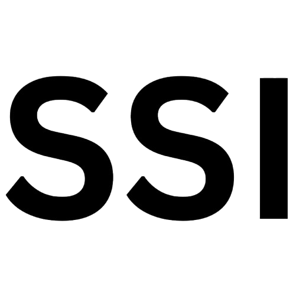
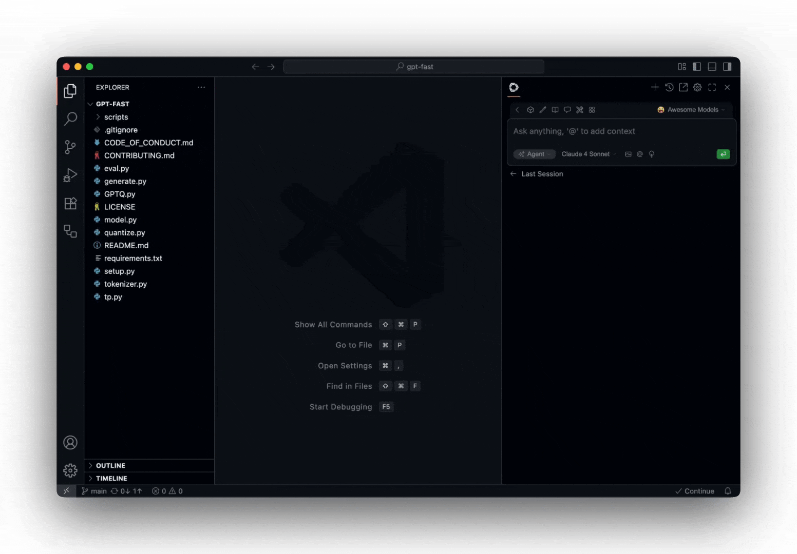
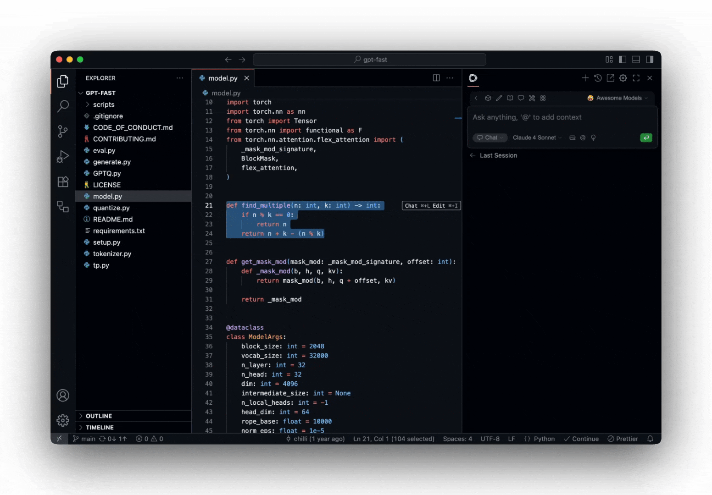

<h1 align="center">SSI Devbuddy</h1>

**Ship faster with SSI Devbuddy AI**

**Build and run custom agents across your IDE, terminal, and CI**

## Agent

[Agent] to work on development tasks together with AI

## Chat

[Chat] to ask general questions and clarify code sections

## Edit

[Edit] to modify a code section without leaving your current file

## Autocomplete

[Autocomplete] to receive inline code suggestions as you type

## License

[Apache 2.0 © 2023-2024 SSI Devbuddy Dev, Inc.](./LICENSE)
